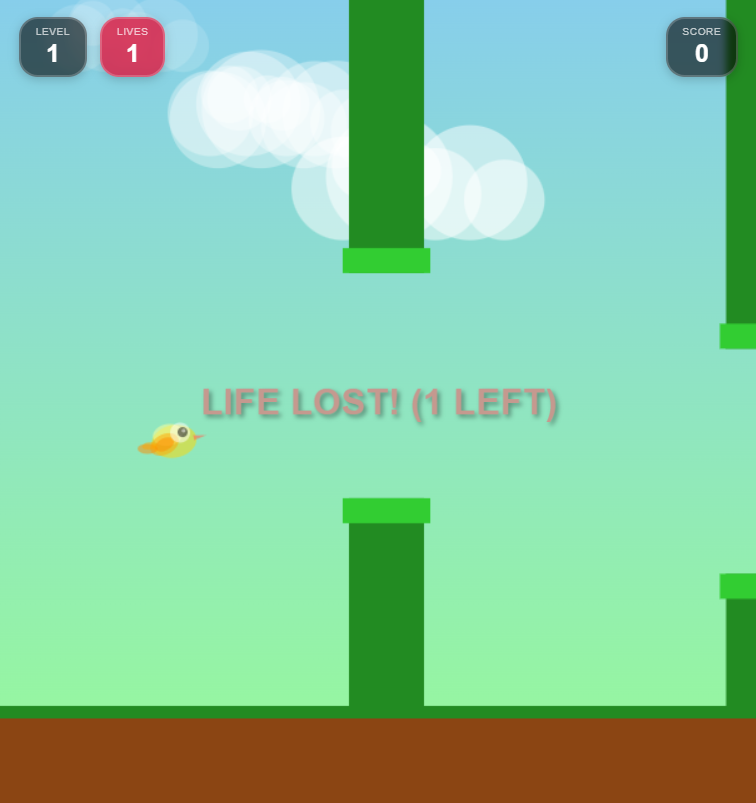
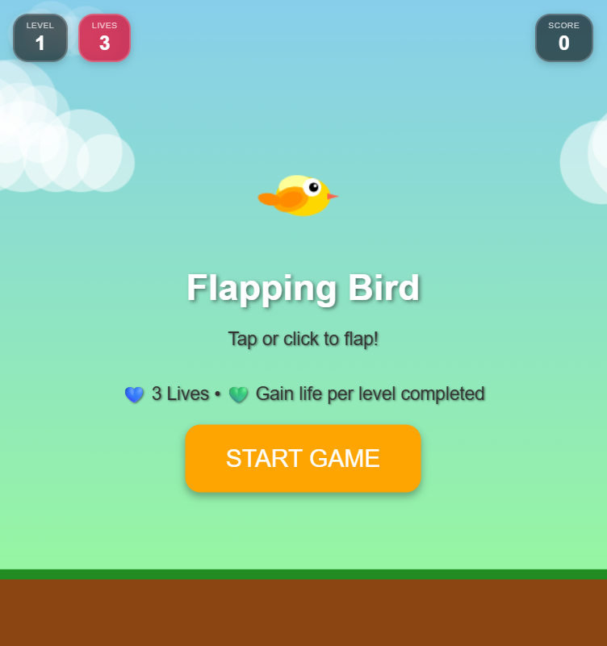
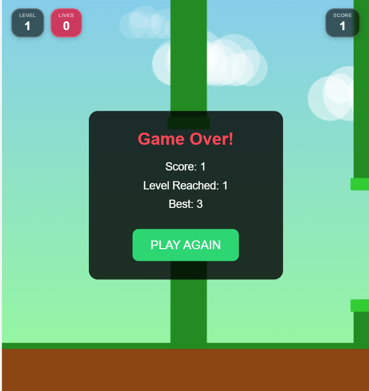

<h1 align="center">🐦 Flapping Bird Game</h1>

<p align="center">
  🎮 A smooth, animated, and addictive Flappy Bird-style game built using HTML, CSS & JavaScript  
</p>

<p align="center">
  
  
  
  
</p>

---

## 🎥 Gameplay Preview

<p align="center">
  
</p>
🔗 **ENJOY😍TO🥰PLAY🎮GAME:**  https://flapping-bird-ten.vercel.app/

## 🎯 Features

✨ Smooth bird animation  
✨ Dynamic levels system  
✨ Beautiful backgrounds (Morning → Night → Space 🌌)  
✨ Lives system ❤️  
✨ Level-up animation 🎉  
✨ Responsive for mobile 📱  
✨ Score tracking 🏆  
✨ Game Over screen with restart  

---

## 🕹️ How to Play

👉 Click / Tap / Press Space to flap  
👉 Avoid pipes 🚫  
👉 Score points to level up ⬆️  
👉 Gain extra lives 💚  
👉 Survive as long as possible 😎  

---

## 📸 Screenshots (Step by Step)

### 🔐 Start / Login Screen
<p align="center">
  
</p>

---

### 🎮 Playing Screen
<p align="center">
  
</p>

---

### 🏁 Result / Game Over Screen
<p align="center">
  
</p>

---

## ⚙️ Installation & Run

```bash
# Clone the repository
git clone https://github.com/kavin553/flapping-bird.git

# Open the folder
cd flapping-bird

# Run the game
Open index.html in browser
